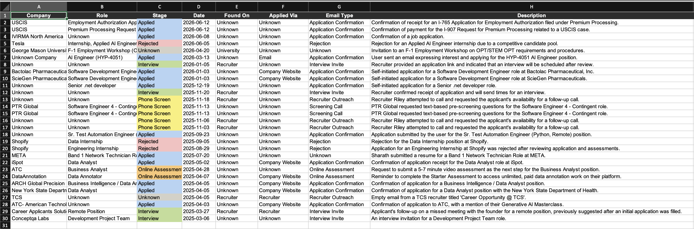
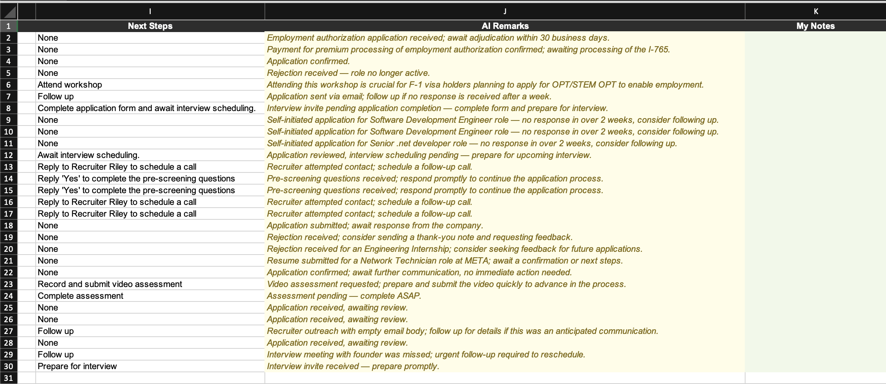
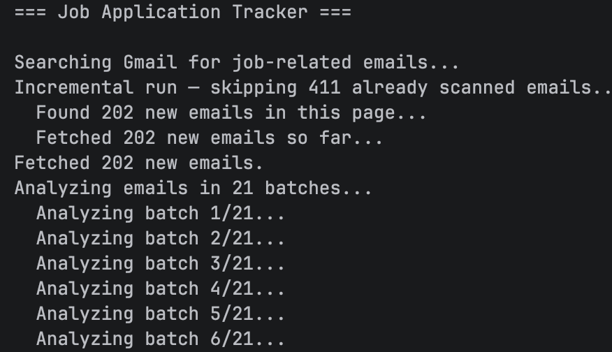
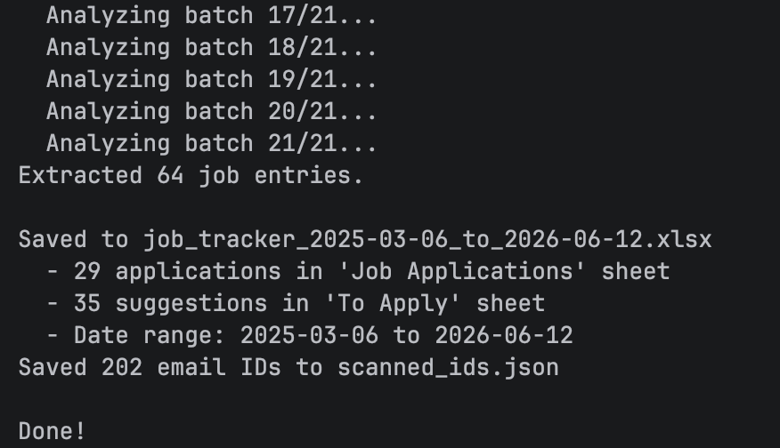
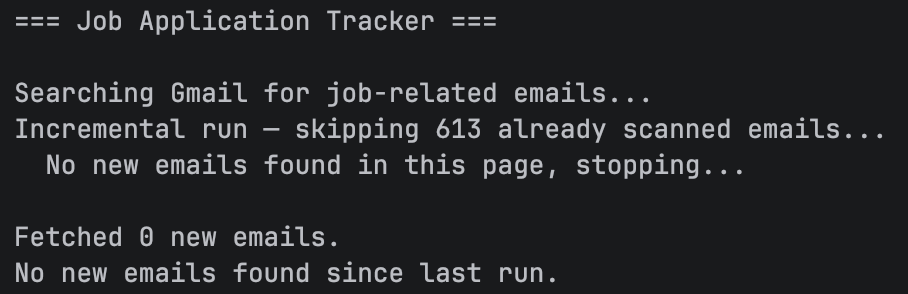

# 📬 Application Tracker

> *Because your inbox shouldn't be your job search dashboard.*


---

## 🤯 The Problem

You've applied to 50+ jobs. Your inbox has 400+ emails. And you have absolutely no idea:

- Did you already apply to that company?
- Was that email a real interview invite or just a job alert?
- Which applications went completely silent?
- What were you supposed to follow up on last week?

**Sound familiar?** This tool fixes that.

---

## ✨ What It Does

One command. That's all it takes.

```bash
python job_tracker.py
```

The script:
1. 📥 **Reads** all your job-related emails from Gmail
2. 🤖 **Sends** them to Gemini AI for analysis
3. 📊 **Saves** everything into a clean, color-coded Excel file

No manual entry. No copy-pasting. No chaos.

---

## 📊 What You Get

A fully structured Excel file with two sheets:

### Sheet 1 — Job Applications
| Column | What It Tells You |
|---|---|
| 🏢 Company | Who the email is from |
| 💼 Role | What position you applied for |
| 🎯 Stage | Where you are in the process |
| 📅 Date | When the email arrived |
| 🔍 Found On | LinkedIn / Indeed / Glassdoor / etc. |
| 📨 Applied Via | Easy Apply / Workday / Greenhouse / etc. |
| 📧 Email Type | Confirmation / Rejection / Interview Invite / etc. |
| 📝 Description | One-line AI summary |
| ➡️ Next Steps | What to do next |
| 🤖 AI Remarks | Smart observations from Gemini |
| ✏️ My Notes | Your own manual notes |

### Sheet 2 — To Apply
Recruiter suggestions and job alerts you haven't acted on yet — surfaced as a clean, actionable list.

---

## 🎨 Stage Color Coding

| Stage | Color |
|---|---|
| Applied | 🔵 Light Blue |
| Phone Screen | 🟡 Yellow |
| Online Assessment | 🟠 Orange |
| Interview | 🟢 Green |
| Offer | 🟣 Purple |
| Rejected | 🔴 Red |

---

## 📸 Screenshots

**Job Applications Sheet**


**AI Remarks & Next Steps**


**Terminal — Analyzing emails in batches**




**Terminal — Incremental run (no new emails)**


---

## 🚀 Setup

### 1️⃣ Gmail API
- Go to [console.cloud.google.com](https://console.cloud.google.com)
- Create a project → Enable **Gmail API**
- Create **OAuth 2.0 credentials** (Desktop app type)
- Download as `credentials.json` → place in project folder
- Add your Gmail under **OAuth consent screen → Test Users**

### 2️⃣ Gemini API Key
- Go to [aistudio.google.com](https://aistudio.google.com)
- Click **Get API Key** → **Create API key in new project**
- Copy the key

### 3️⃣ Install Dependencies
```bash
pip install google-auth google-auth-oauthlib google-api-python-client google-genai openpyxl python-dotenv
```

### 4️⃣ Configure
Create a `.env` file in the project folder:
```
GEMINI_API_KEY=your-gemini-api-key-here
```

### 5️⃣ Run
```bash
python job_tracker.py
```

---

## 🔄 How Incremental Runs Work

| Run | What Happens |
|---|---|
| First run | Fetches ALL emails from the very beginning of your Gmail |
| Every run after | Only fetches emails you haven't seen before |

Every processed email ID is saved to `scanned_ids.json` locally. Nothing ever gets missed or duplicated — regardless of when you run it.

The output file is saved as:
```
job_tracker_2024-01-15_to_2026-06-23.xlsx
```

---

## 🔐 Security

Never commit these files — they're already in `.gitignore`:

```
.env                  ← your Gemini API key
credentials.json      ← your Google OAuth credentials  
token.json            ← your Gmail access token
scanned_ids.json      ← your processed email IDs
*.xlsx                ← your job data
```

---

## 👥 Using This With Other People

While the app is in **test mode**, you can add up to 100 users:

1. Go to Google Cloud Console → **OAuth consent screen** → **Test Users**
2. Add their Gmail address
3. Share `credentials.json` and `job_tracker.py` with them
4. They run `python job_tracker.py` — a browser opens asking them to sign into **their own** Gmail
5. Their data stays completely local to their machine

---

## 🛣️ What's Next

- [ ] Summary sheet with charts — applications by week, stage breakdown
- [ ] Deduplication — merge multiple emails from the same company
- [ ] Web UI — so non-technical users can run it without touching code
- [ ] Auto-run on schedule — daily refresh without manual trigger

---

## 🤝 Contributing

Found a bug? Have an idea? PRs are welcome.

1. Fork the repo
2. Create a branch (`git checkout -b feature/your-idea`)
3. Commit your changes
4. Open a pull request

---

## 📄 License

MIT — do whatever you want with it.

---

*Built out of frustration with my own job search inbox. Hope it helps yours too.* 🙏